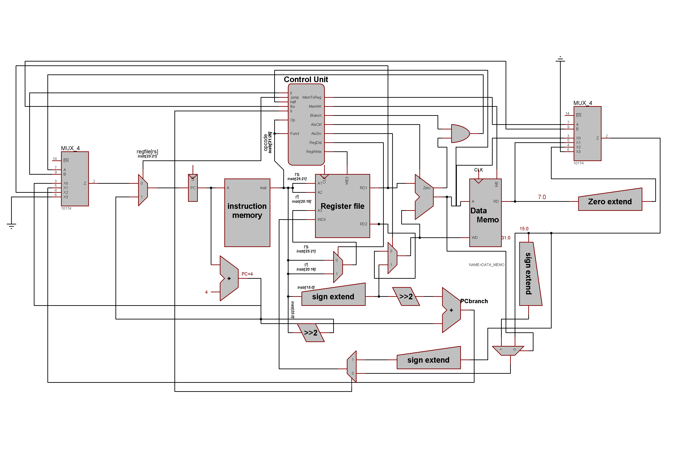

## jr : R-type instruction with funct=8
```
jr $rs
```
example:
```
jr $r7
pc=$r7
```
- puts rs : instr[25:21] value inside PC reg to perform unconditional jump via reg value
- jr signal added to controller and is assigned to 1 when funct=8 and opcode =8
- implementation :
    - MUX with four selectors  with inputs (PC+4,PC Branch,srca,zeros) and selectros {pcsrc,jr}
      - srca in code is RD1 in diagram(value of rs)
    

| jr   | pcsrc | output    |
| :--- | ----- | --------- |
| 0    | 0     | PC        |
| 0    | 1     | PC branch |
| 1    | 0     | srca      |
| 1    | 1     | zeros     |

## lbu : I-TYPE instruction with OPCODE = 6'b(100100)
```
lbu $rt, imm($rs)
```
example:
```
lbu $r7  82($r3)
r7=memory[82/4+r3]
r3 is base address and imm is offest
```
- lbu signal added to control unit  and is assigned to 1 when OPCODE = 6'b(100100) to write value at base address ```rs``` with offest  ```imm ```

    - implementation :
      
        - MUX with four selectors  with inputs (alu output ,output of data memory,output of data memory [7:0],zeros) and selectros {memtoreg,lbu}
        
          
        
        | memtoreg | lbu  | output                          |
        | :------- | ---- | ------------------------------- |
        | 0        | 0    | alu output                      |
        | 0        | 1    | Data memory                     |
        | 1        | 0    | zeroext(Data memory from [7:0]) |
        | 1        | 1    | zeros                           |
    
       

