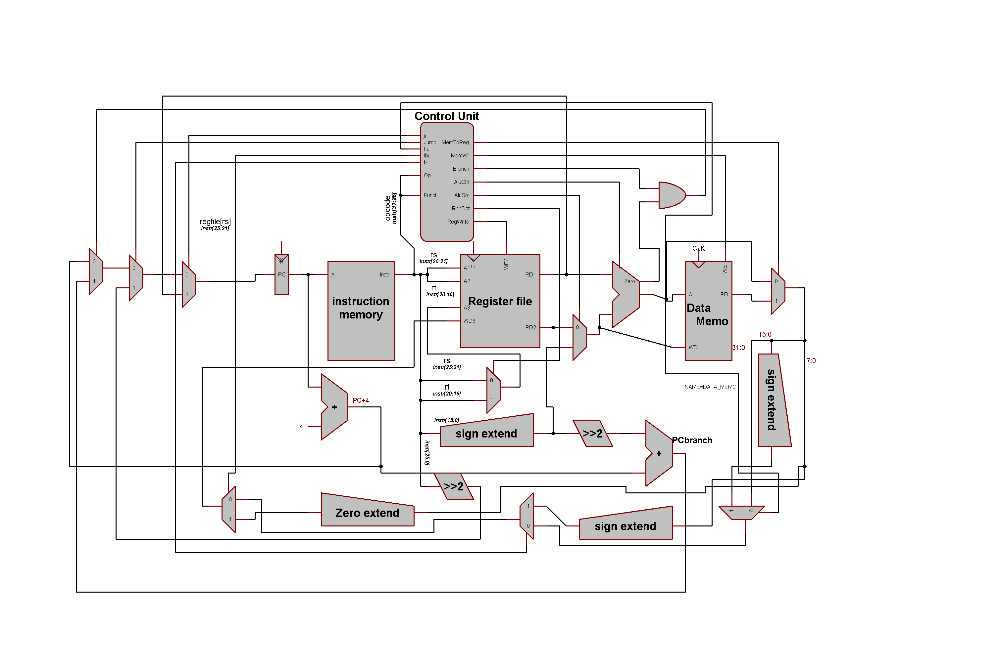

# jr : R-type instruction with funct=8
- puts rs : instr[25:21] value inside PC reg to perform unconditional jump via reg value
- jr signal added to controller and is assigned to 1 when funct=8 and opcode =8
- implementation :
    - MUX added after the muxes of jump and pcsrc too set pc to regfile[rs] when jr =1 
    - when jr =0 pc will be set to value from the muxes that depend on pcsrc and jump
    
# lbu : I-TYPE instruction with OPCODE = 6'b(100100)
- puts regfile[rt]  = instr[7:0] as unsigned value 
- rt signal added to control unit  and is assigned to 1 when OPCODE = 6'b(100100)

-implementation :
    - MUX added after the muxes of lhf and lb too set pc to setregfile[rt]  = instr[7:0] as unsigned value  when lbu =1 
    - when lbu =0 pc will be set to value from the muxes that depend on b and half  
    
   
