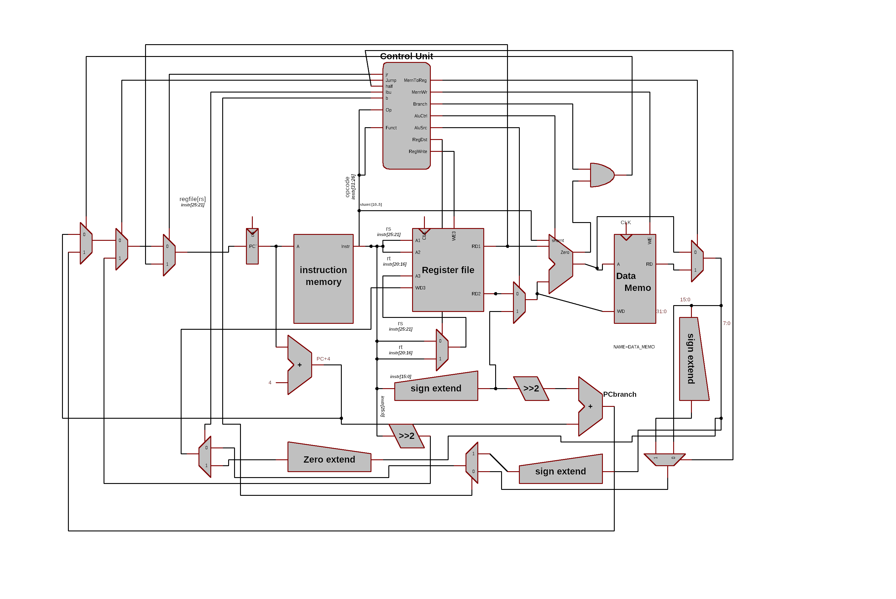

# Andi logic instruction:

The **andi** instruction does a bitwise AND of two 32-bit patterns. At
run time the 16-bit immediate operand is padded on the left with zero
bits to make it a 32-bit operand.

the following is a machine code description for andi:
```assembly
andi \$rt, \$rs, immed
```
## Recipe:

replace sign extend to zero extend.

changing ALUSel(Alu op).

## implementation:

this design is based on the fact that addi with some modify

alu op 001100

## schmatic

