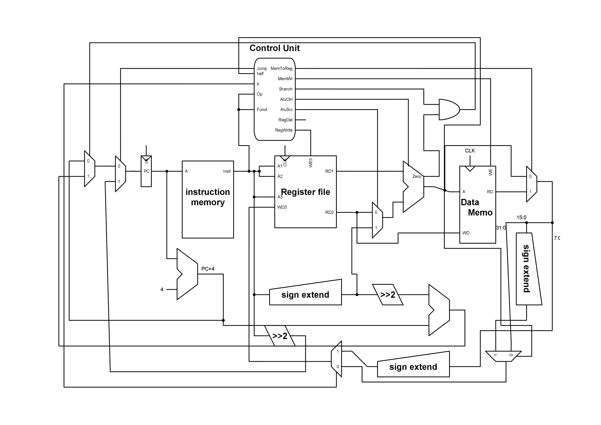

## Load half and load byte

### introduction:

a "Load half" and "Load byte" implementation using MIPS micro-architecture was built upon Harris design in their book (reference)

`lh $storeReg imm($regRefearingToMemAddress)`

`lb $storeReg imm($regRefearingToMemAddress)`

the following is a machine code description for lh and lb

```
 lh: 100001 $regRefearingToMemAddress $storeReg iiiiiiii iiiiiiii
 lb: 100000 $regRefearingToMemAddress $storeReg iiiiiiii iiiiiiii
```

### Recipe:

#### Items/Pins:

1. pin_b (byte) :  used as a selector for mux[2]
2. half (half-word) : used as a selector for mux[1]
3. mux[1] (multiplexer): a multiplexer provide an option to full word or half word
4. mux[2] (multiplexer): a multiplixer provide an option to mux[1] or one byte

#### implementation:

this design is based on the fact that `lw` was already implemented and working well so why not to reuse it? at the output of  **MemToReg** multiplexer (`lw`'s output) i've used two multiplexers mux[1] and mux [2]

mux[1] will chose from the full word (32-bit) and a sign-extended half word `{16{halfword[15]},halfword[15:0]}` using **half pin** as a controller

| option (half pin) | operation                                |
| ----------------- | ---------------------------------------- |
| 0                 | output of mux[1] equals the full word    |
| 1                 | output of mux[1] equals half of the word |

mux[2] will chose from mux[1] output and a sign-extended one byte `{24{8-bits[7]},8-bits[7:0]}` using **half pin** as a controller

| option (b pin) | operation                                      |
| -------------- | ---------------------------------------------- |
| 0              | output of mux[2] equals mux[1]                 |
| 1              | output of mux[2] equals sign extended one byte |

#### schematic:



#### Code:
refearing to the diff [file](https://github.com/A-Siam/lhlb-mips/blob/master/diff.diff
) to make a quick review to what i've changed/added 
### Reference:

Digital design and computer architecture by David and Sarah Harris

## jr : R-type instruction with funct=8
```
jr $rs
```
example:
```
jr $r7
pc=$r7
```
- puts rs : instr[25:21] value inside PC reg to perform unconditional jump via reg value
- jr signal added to controller and is assigned to 1 when funct=8 and opcode =8
- implementation :
    - MUX with four selectors  with inputs (PC+4,PC Branch,srca,zeros) and selectros {pcsrc,jr}
      - srca in code is RD1 in diagram(value of rs)
    

| jr   | pcsrc | output    |
| :--- | ----- | --------- |
| 0    | 0     | PC        |
| 0    | 1     | PC branch |
| 1    | 0     | srca      |
| 1    | 1     | zeros     |

## lbu : I-TYPE instruction with OPCODE = 6'b(100100)
```
lbu $rt, imm($rs)
```
example:
```
lbu $r7  82($r3)
r7=memory[82/4+r3]
r3 is base address and imm is offest
```
- lbu signal added to control unit  and is assigned to 1 when OPCODE = 6'b(100100) to write value at base address ```rs``` with offest  ```imm ```

    - implementation :
      
        - MUX with four selectors  with inputs (alu output ,output of data memory,output of data memory [7:0],zeros) and selectros {memtoreg,lbu}
        
          
        
        | memtoreg | lbu  | output                          |
        | :------- | ---- | ------------------------------- |
        | 0        | 0    | alu output                      |
        | 0        | 1    | Data memory                     |
        | 1        | 0    | zeroext(Data memory from [7:0]) |
        | 1        | 1    | zeros                           |
    
       

# Andi logic instruction:

The **andi** instruction does a bitwise AND of two 32-bit patterns. At
run time the 16-bit immediate operand is padded on the left with zero
bits to make it a 32-bit operand.

the following is a machine code description for andi:

```assembly
andi \$rt, \$rs, immed
```

## Recipe:

replace sign extend to zero extend.

changing ALUSel(Alu op).

## implementation:

this design is based on the fact that addi with some modify

alu op 001100

## schmatic


# Shift Right Logical:

## introduction:

MIPS also has a **shift right logical** instruction. It moves bits to
the right by a number of positions less than 32. The high-order bit gets
zeros and the low-order bits are discarded.

If the bit pattern is regarded as an unsigned integer, or a positive
two\'s comp. integer, then a right shift of one bit position performs an
integer divide by two. A right shift by N positions performs an integer
divide by 2^N^.

the following is a machine code description for Srl:
```assembly
srl \$rs \$rt shift
```

## Recipe:

mux\[\] (multiplexer): It would select Read data 1(rs) if we\'re not
doing a shift operation, and it would select( rt) if we are doing a
shift operation.

branch Instruction: we would need to branch Instruction\[10:6\] (the
shift amount) off of Instruction\[15:0\], and Instruction\[10:6\] would
then be fed into the other port of the ALU

### implementation:

| option (shift) | operation |
|----------------|------------------------------|
|0               |  output of mux\[1\] equals not doing a shift   |
|1               |  output of mux\[1\] equals doing a shift operation. |

## schmatic


## Jal : I-type instruction (opcode = 000011)
This instruction performs a normal jump but we need to save the return address (pc + 4) during the jump .
The return address ```(pc + 4)``` is saved in the register ```$ra (31)``` .
We added a signal called link to perform this instruction.
We added two muxes (controlled by the signal link) :
- First mux to put (pc + 4 ) in the the result signal.
- second mux to make ```$ra``` the destination register (write result in $ra ).
- jump signal should be on (jump = 1).

