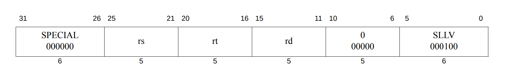
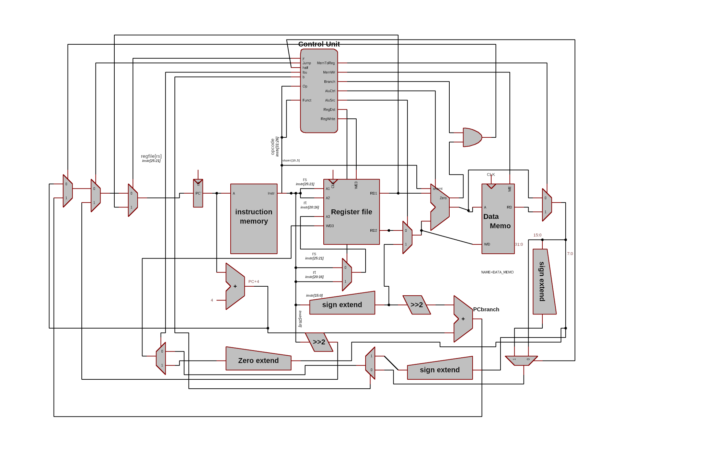

<!-- [toc] -->
\newpage

# Andi  _and immediate:

The **andi** instruction does a bitwise AND of two 32-bit patterns. At
run time the 16-bit immediate operand is padded on the left with zero
bits to make it a 32-bit operand.

the following is a machine code description for andi:

```assembly
andi \$rt, \$rs, immed
```

## Recipe:

replace sign extend to zero extend.

changing ALUSel(Alu op).

## implementation

this design is based on the fact that addi with some modify

alu op 001100

## schmatic


\newpage

# Addiu _ add immediate unsigned 

The **addiu** instruction does a anddition of two 32-bit . At
run time the 16-bit immediate operand is sigen extended to make it a 32-bit operand. the following is a machine code description for addiu:

```assembly
addiu rt, rs, immed
```

## implementation

this design is based on the fact that addiu is identical to addi with deffrent overflow behavior

sign | value
---- | ----
REgWrite | 1
RegDST | 0
ALUSrc | 01
Branch | 0
MemWrite | 0
MemtoReg | 0
Jump | 0
jr | 0
aluop | 0000

\newpage

## schmatic


\newpage

# jr _jump regester 
R-type instruction with funct=8

## assembly

```assembly
jr $rs
```

## example

```assembly
jr $r7
pc=$r7
```

## implementation

- puts rs : instr[25:21] value inside PC reg to perform unconditional jump via reg value
- jr signal added to controller and is assigned to 1 when funct=8 and opcode =8
- implementation :
  - MUX with four selectors  with inputs (PC+4,PC Branch,srca,zeros) and selectros {pcsrc,jr}
    - srca in code is RD1 in diagram(value of rs)

| jr   | pcsrc | output    |
| :--- | ----- | --------- |
| 0    | 0     | PC        |
| 0    | 1     | PC branch |
| 1    | 0     | srca      |
| 1    | 1     | zeros     |

\newpage

# lbu _ load byte unsigned
I-TYPE instruction with OPCODE = 6'b(100100)

## assembly

```assembly
lbu $rt, imm($rs)
```

## example

```assembly
lbu $r7  82($r3)
r7=memory[82/4+r3]
r3 is base address and imm is offest
```

## implementation

- lbu signal added to control unit  and is assigned to 1 when OPCODE = 6'b(100100) to write value at base address ```rs``` with offest  ```imm ```

- MUX with four selectors  with inputs (alu output ,output of data memory,output of data memory [7:0],zeros) and selectros {memtoreg,lbu}

| memtoreg | lbu  | output                          |
| :------- | ---- | ------------------------------- |
| 0        | 0    | alu output                      |
| 0        | 1    | Data memory                     |
| 1        | 0    | zeroext(Data memory from [7:0]) |
| 1        | 1    | zeros                           |

## schmatic


\pagebreak

# lh , lb  _ Load half and load byte

## introduction

a "Load half" and "Load byte" implementation using MIPS micro-architecture was built upon Harris design in their book (reference)

`lh $storeReg imm($regRefearingToMemAddress)`

`lb $storeReg imm($regRefearingToMemAddress)`

the following is a machine code description for lh and lb

```
 lh: 100001 $regRefearingToMemAddress $storeReg iiiiiiii iiiiiiii
 lb: 100000 $regRefearingToMemAddress $storeReg iiiiiiii iiiiiiii
```

## Recipe

### Items/Pins

1. pin_b (byte) :  used as a selector for mux[2]
2. half (half-word) : used as a selector for mux[1]
3. mux[1] (multiplexer): a multiplexer provide an option to full word or half word
4. mux[2] (multiplexer): a multiplixer provide an option to mux[1] or one byte

### implementation

this design is based on the fact that `lw` was already implemented and working well so why not to reuse it? at the output of  **MemToReg** multiplexer (`lw`'s output) i've used two multiplexers mux[1] and mux [2]

mux[1] will chose from the full word (32-bit) and a sign-extended half word `{16{halfword[15]},halfword[15:0]}` using **half pin** as a controller

| option (half pin) | operation                                |
| ----------------- | ---------------------------------------- |
| 0                 | output of mux[1] equals the full word    |
| 1                 | output of mux[1] equals half of the word |

mux[2] will chose from mux[1] output and a sign-extended one byte `{24{8-bits[7]},8-bits[7:0]}` using **half pin** as a controller

| option (b pin) | operation                                      |
| -------------- | ---------------------------------------------- |
| 0              | output of mux[2] equals mux[1]                 |
| 1              | output of mux[2] equals sign extended one byte |

#### schematic


#### Code:

refearing to the diff [file](diff.diff) to make a quick review to what i've changed/added 

### Reference

Digital design and computer architecture by David and Sarah Harris

\newpage

# sh, sb _ Store half and store byte

## introduction

a "store half" and "store byte" implementation using MIPS micro-architecture was built upon Harris design in their book (reference)

`sh $ Registering value imm($regRefearingToMemAddress)`

`sb $Registering value imm($regRefearingToMemAddress)`

the following is a machine code description for sh and sb

```
 sh: 101001  $regRefearingToMemAddress $storeReg iiiiiiii iiiiiiii
 sb: 101000  $regRefearingToMemAddress $storeReg iiiiiiii iiiiiiii
```

## implementation

this design is based on the fact that `sw` was already implemented and working well so why not to reuse it? at the   controller we make the **MemWr pin** 2 bits and  **WE pin** also 2 bits,

in `sw`the  alu result  is  address  [**32** bit] of the word and to move to the next word we sift the address  left  twice to add **4**  so we always have  **2** bits is **00**  , we use this two bits to  determined which number of bits in data memory to put the value of **reg** according to the following table :

| option ( WE pin) | operation                                                    |
| ---------------- | ------------------------------------------------------------ |
| 0 0              | don't care                                                   |
| 0 1              | store word ,RAM[a[31:2]] <= wd;                              |
| 1 0              | store half word , {a[1],4'b0000}  uses the second LSB as an indeicator to the upper or lower word starting point which is an intuitive approuch to reach the half word |
| 1 1              | store byte , {a[1:0],3'b000} uses the first and second LSB as an indeicator to the specified byte starting point which is an intuitive approuch to reach the byte |

\newpage

## schematic


## Code

refearing to the diff [file](diff__sh_sb.diff)
 to make a quick review to what i've changed/added 

### Reference

Digital design and computer architecture by David and Sarah Harris

\newpage

# sllv _ Shift Word Left Logical Variable

## introduction

sllv an (R type) instraction for shifting left a word by varible number

## machine code



| opcode | function|
|--------------|------------|
| 000000 | 000100 |

### asembly format

```asm
sllv rd, rs, rt
```

## operation

sllv would shit the value in reg(rs) ,by a number stored in low five bits in reg(rt),saving result in reg(rd)

## implentaion

- add sllv operation in alu 

### controls [r-type_controls](../control.csv)

|signal 	|value|
|-----------|-----|
|REgWrite   |	1|
|RegDST |	0|
|ALUSrc |	11|
|Branch |	0|
|MemWrite   |	0|
|MemtoReg   |	0|
|Jump   |	0|

## code changes

### [alu.sv](../alu.sv)

add shift left operationg

```systemverlog
y = b << a[4:0]
```

### [aludec.sv](../aludec.sv)

chage the alucontrol to sllv

| function    | alucontrol|
|-------------|----------------|
| 000100      |  < sllv operation >|

### schematic


### Reference:

[MIPS® Architecture for Programmers set manulal 2016](https://s3-eu-west-1.amazonaws.com/downloads-mips/documents/MD00086-2B-MIPS32BIS-AFP-6.06.pdf) 
`pg377`

\newpage

# srl _ Shift Right Logical

## introduction

MIPS also has a **shift right logical** instruction. It moves bits to
the right by a number of positions less than 32. The high-order bit gets
zeros and the low-order bits are discarded.

If the bit pattern is regarded as an unsigned integer, or a positive
two\'s comp. integer, then a right shift of one bit position performs an
integer divide by two. A right shift by N positions performs an integer
divide by 2^N^.

the following is a machine code description for Srl:

```assembly
srl \$rs \$rt shift
```

## implementation

mux\[\] (multiplexer): It would select Read data 1(rs) if we\'re not
doing a shift operation, and it would select( rt) if we are doing a
shift operation.

branch Instruction: we would need to branch Instruction\[10:6\] (the
shift amount) off of Instruction\[15:0\], and Instruction\[10:6\] would
then be fed into the other port of the ALU

## schematic:


